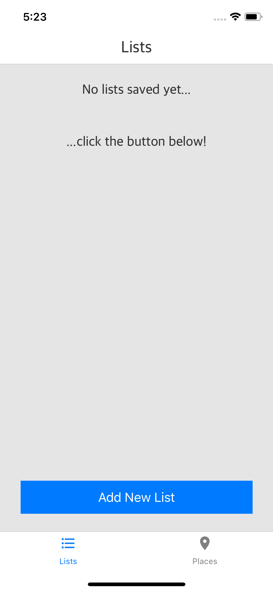
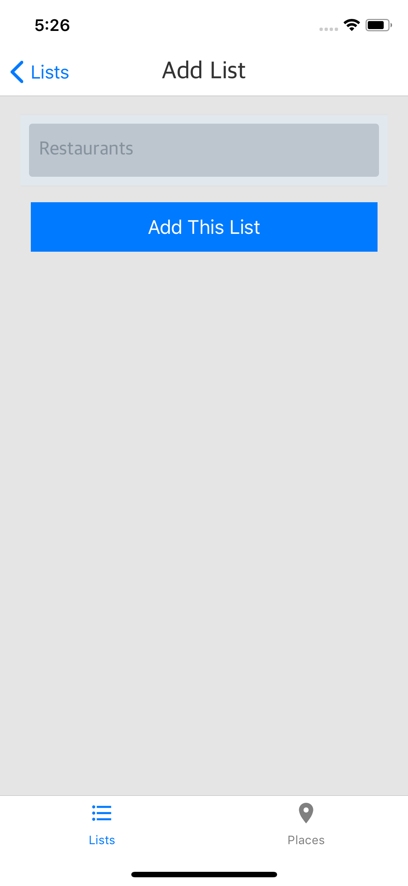
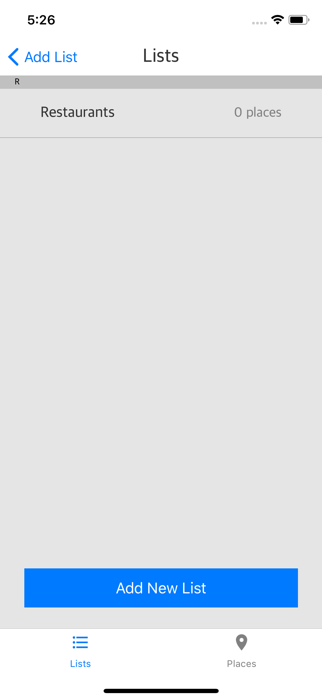
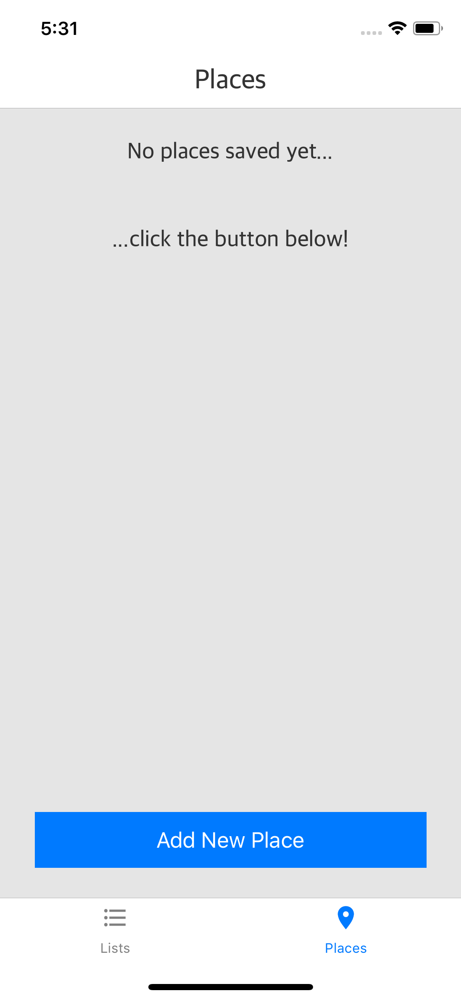
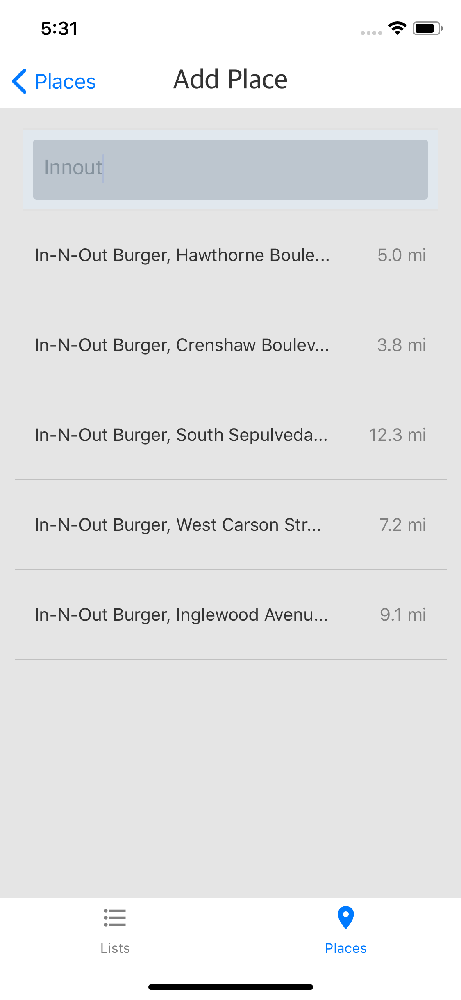
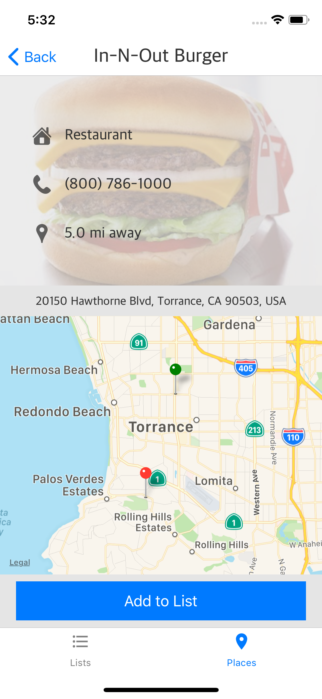
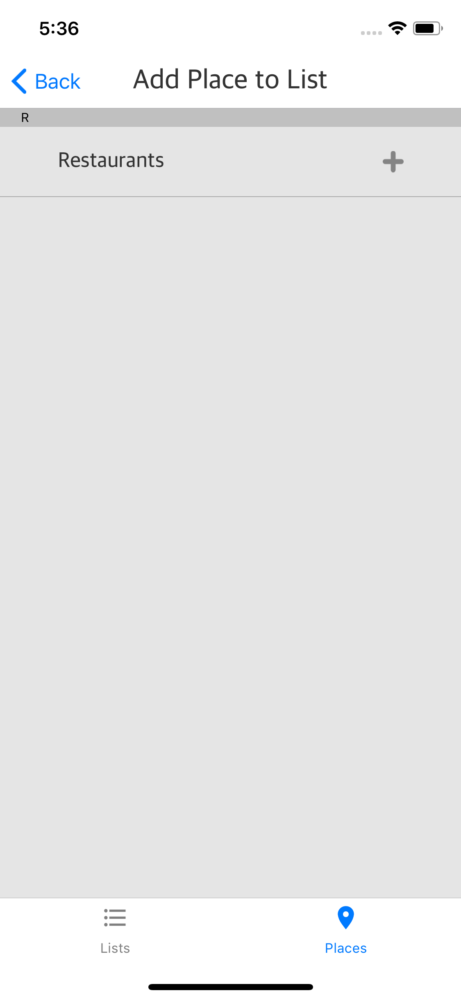
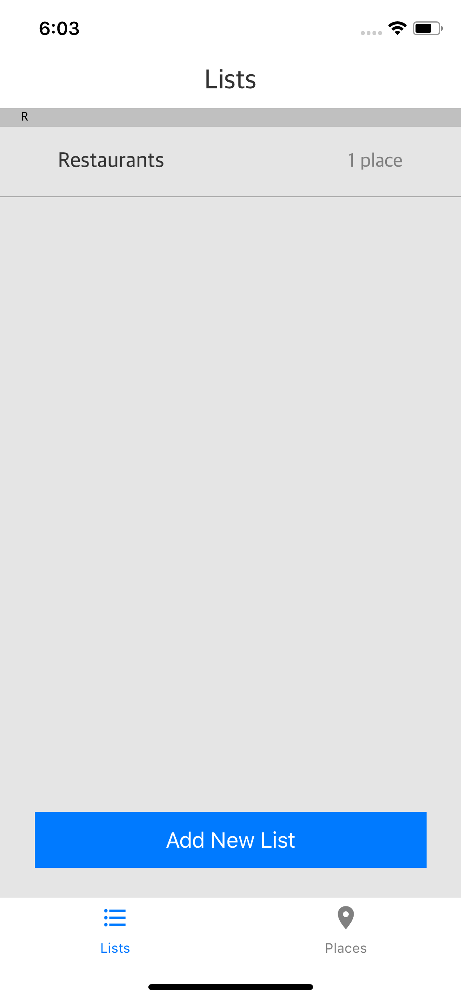
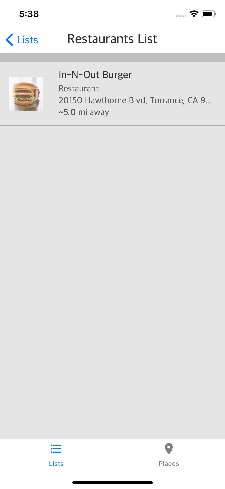
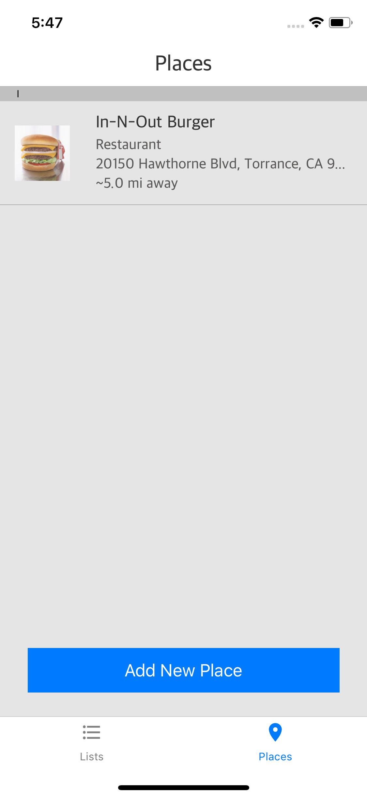

# Placify App

App can be viewed by using [Expo CLI](https://docs.expo.io/versions/latest/guides/exp-cli.html) and [Xcode](https://developer.apple.com/xcode/). To start the app, please do the following:

### Setup

1) Download the Expo CLI through the link above
2) Download Xcode, which should come with the iOS simulator that displays the app
3) Get a [Google Maps API key](https://cloud.google.com/maps-platform/) enabled for Places API for Web && Distance Matrix API (second one is important as well)

### Installation

4) `git clone` this repository
5) `npm install`
6) Make sure `npm react-native-dotenv --save` is installed (this is handling our config variables). Follow instructions [here](https://www.npmjs.com/package/react-native-dotenv) and set your config variable to `gPlaces_API_KEY`
7) Login to your expo account by typing in `exp login` in the terminal
8) Navigate to this project directory and type `exp start` in the terminal
9) Then open the iOS Simulator and navigate to the Expo app (if you don't have it you can download it)
10) The project should appear as "Recently in development". If you click on the project and Expo gives you an error, try restarting the application by running `exp start --tunnel` and retrying step 9

# How It Works

Placify is a React Native-based mobile app created to help you find and track relevant places near you.

The app is based upon creating lists that pertain to different categories, so that we can more easily and efficiently keep track of different places. For example, say I wanted to keep track of my favorite restaurants -- I would first create a new list, within the "Lists" tab called "Restaurants", then navigate to the "Places" tab to search for restaurants in the vicinity. Finally, I would add all the restaurants I love to my "Restaurants" list, for quick accessibility of any restaurant information. We'll go through the flow below --

### Step 1: Create a List
 * Upon opening the app, it should navigate to the "Lists" screen
 * Here we will create a new list by clicking the "Add New List" button
 * Let's type a list name into the input bar
 * Upon creating a list, we should navigate back to the "Lists" screen where our new list is made!

  

   
   
   
  

### Step 2: Search New Places
  * Let's navigate to the "Places" tab and lick on the "Add New Place" button
  * Next, let's type in to the search bar. By using **Google Places API** and **Google Distance Matrix API**, we are able to display the highest relevance search results nearest to you, while also displaying the distance in real-time
  * Now click on one of the results, which takes us to a one-pager profile on that search result

  

    
    
    
  

### Step 3: Add Place to List
  * To add this place to a list, we click on the "Add to List" button
  * Then thanks to **Redux**, our lists were persisted and sorted alphabetically
  * Upon clicking on a list, we are navigated back to the "Lists" screen, were now we can see the list we just clicked on now has an additional place

  

    
  

### Step 4: View Saved Place Profiles
  * Now we can view the saved place profiles in a variety of ways
  * We can click on a list in our "Lists" screen to see all of our places saved by list. If we want to view the place profile again, we can just click on the mini-profile
  * OR we can navigate back to the "Places" tab and view all of our places uncategorized and sorted alphabetically

  

    
    
    
    
  

## v2 Features
  * Delete lists and places
  * Persist lists and places in Firebase database
  * Add custom places (friend's houses, etc.)
  * Add places uncategorized by list
  * "Go Here" button integrating with Google Maps / Uber for quick, preset trips
  * More modular styling implementation

## Key Technologies Used
  * React-Native
  * React-Navigation
  * Redux
  * Thunk for Redux
  * Async / Await ES6
  * Google Places API
  * Google Distance Matrix API
  * React-Native-Maps
  * React-Native-Responsive-Screen

* Submit to code-challenge@tapptravel.co with in time limit
  * subject line of your name, ‘submission’ and date. For example, "Tommy Tapp Submission 08-22-2018"
  * body with link to your repo and roughly how long it took you to complete the challenge.
